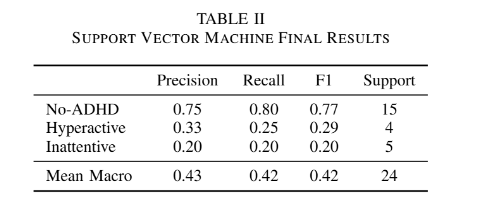
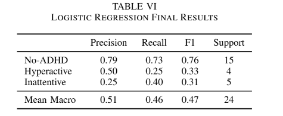
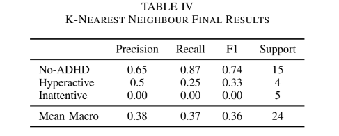

# Machine-Learning-ADHD-Diagnosis
Predict ADHD diagnosis by analyzing movement patterns from smartwatch sensor data. Machine learning models implemented in Python using Scikit-Learn.

**Abstract** - This study aims to advance the tools for detecting
Attention Deficit/Hyperactivity Disorder (ADHD) using machine
learning. This study implements machine learning techniques
on actigraphy data with the goal to distinguish between in
dividuals without ADHD, individuals with hyperactive ADHD,
and individuals with inattentive ADHD. The dataset used is
a public dataset from HYPERAKTIV, containing actigraphy
data over multiple hours from 51 patients with ADHD and 50
clinical controls. The tsfresh python library was used to extract
and select relevant features. Support vector machine, k-nearest
neighbour and logistic regression algorithms were implemented
with each optimized via parameter tuning. The models were
found to perform well at identifying non-ADHD participants
but performed poorly at identifying ADHD subtypes. Among
them, logistic regression performed the best with a Macro F1
score of 0.467. The findings suggest actigraphy data may not be
enough to distinguish between ADHD subtypes and additional
features may be required to improve subtype classification.
There was decent ability to identify individuals without ADHD,
indicating that binary classes of no-ADHD or ADHD may result
in stronger performance for these models and is suggested for
future research.

