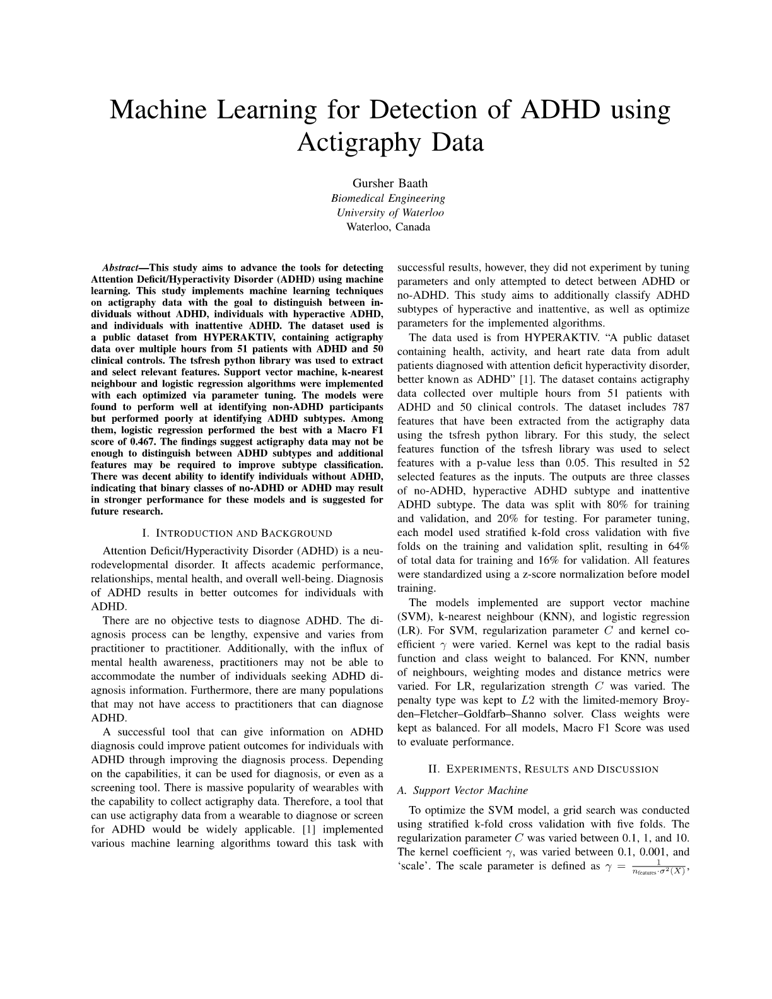
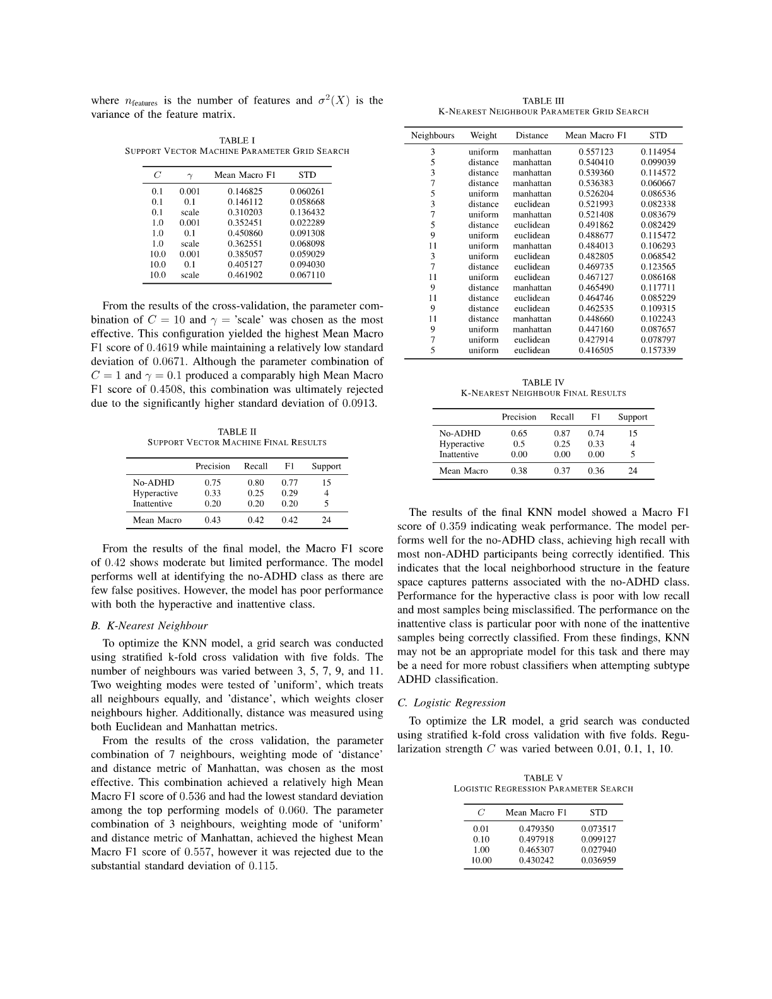
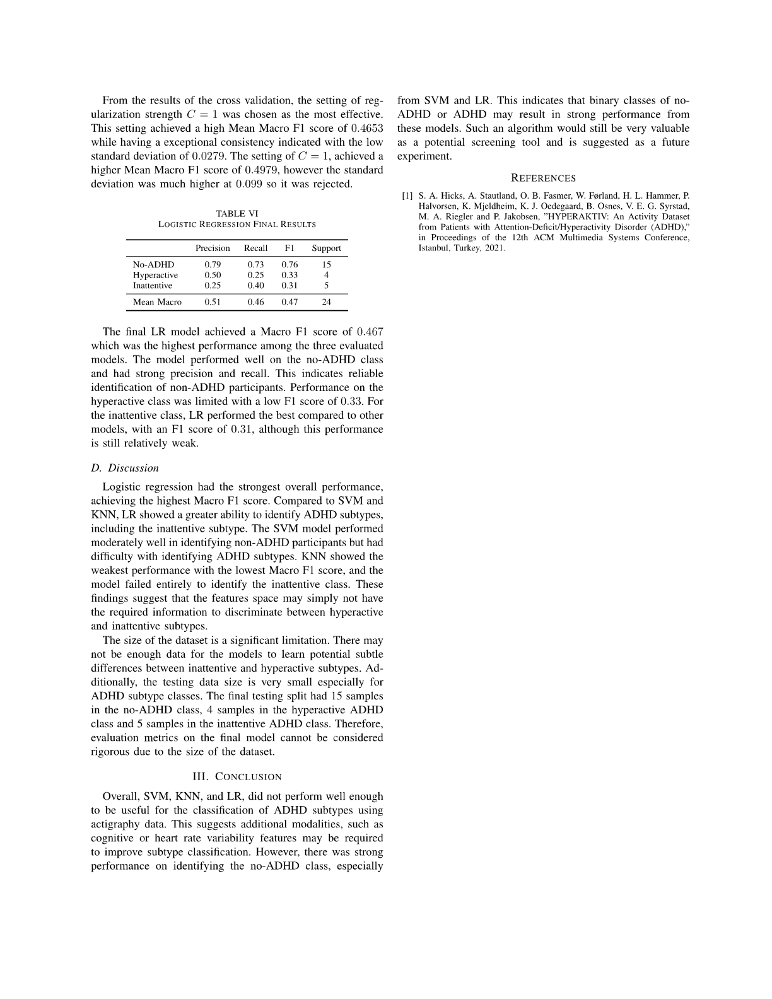

# Machine-Learning-ADHD-Diagnosis
This project aims to predict ADHD diagnosis by analyzing movement patterns from smartwatch sensor data. Machine learning models were implemented in Python using Scikit-Learn.

